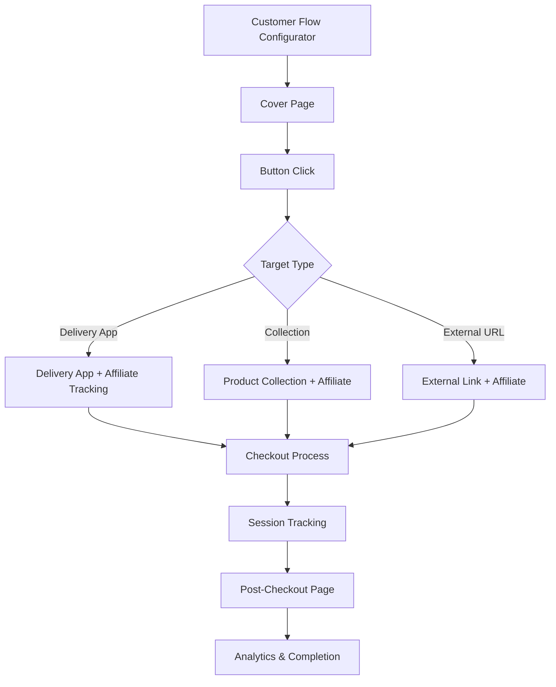

# Customer Journey System Documentation
**Created:** December 21, 2024  
**System Version:** 1.0  
**Last Updated:** December 21, 2024

## 🎯 System Overview
The Customer Journey System is a comprehensive platform for creating end-to-end customer experiences from initial landing to post-purchase completion. It enables complete customization of the customer flow with affiliate tracking, template management, and seamless integration between components.

## 🏗️ Architecture Components

### 1. Cover Page System
**Location:** `src/components/enhanced-admin/EnhancedCoverPageCreator.tsx`
**Database:** `cover_pages` table
**Features:**
- Template-based creation (Gold, Platinum, Original themes)
- Full customization: typography, spacing, colors, animations
- Logo sizing (7 different sizes: 3rem to 12rem)
- Background image/video support
- Button configuration with custom URLs
- SEO optimization
- Mobile-responsive design
- Standalone URLs: `/cover/{slug}`

**Template System:**
- Gold Template: Luxury gold design with premium styling
- Platinum Template: Ultra-premium platinum design  
- Original Template: Clean, modern design with blue accents
- Each template includes pre-configured colors, features, and buttons

### 2. Post-Checkout System
**Location:** `src/components/admin/EnhancedPostCheckoutCreator.tsx`
**Database:** `post_checkout_pages` table
**Features:**
- Template-based creation matching cover page themes
- Customizable thank you messages
- Dual button configuration (primary/secondary actions)
- Logo and background customization
- Color theming system
- File upload support for assets
- Standalone URLs: `/post-checkout/{slug}`

### 3. Customer Flow Configurator
**Location:** `src/components/admin/CustomerFlowConfigurator.tsx`
**Database:** `customer_flows` table
**Features:**
- Complete journey orchestration
- Cover page selection and configuration
- Post-checkout page assignment
- Affiliate tracking integration
- Button URL mapping with affiliate pass-through
- Analytics enablement
- Flow URL generation

## 🔄 Data Flow Architecture



## 📊 Database Schema

### Cover Pages Table
```sql
CREATE TABLE cover_pages (
  id UUID PRIMARY KEY DEFAULT gen_random_uuid(),
  slug TEXT UNIQUE NOT NULL,
  title TEXT NOT NULL,
  subtitle TEXT,
  logo_url TEXT,
  bg_image_url TEXT,
  bg_video_url TEXT,
  checklist JSONB NOT NULL DEFAULT '[]'::jsonb,
  buttons JSONB NOT NULL DEFAULT '[]'::jsonb,
  theme TEXT DEFAULT 'gold',
  styles JSONB DEFAULT '{}'::jsonb,
  is_active BOOLEAN DEFAULT true,
  created_at TIMESTAMP WITH TIME ZONE DEFAULT now(),
  updated_at TIMESTAMP WITH TIME ZONE DEFAULT now()
);
```

### Post-Checkout Pages Table
```sql
CREATE TABLE post_checkout_pages (
  id UUID PRIMARY KEY DEFAULT gen_random_uuid(),
  name TEXT NOT NULL,
  slug TEXT UNIQUE NOT NULL,
  content JSONB NOT NULL DEFAULT '{}'::jsonb,
  is_active BOOLEAN DEFAULT true,
  is_default BOOLEAN DEFAULT false,
  created_at TIMESTAMP WITH TIME ZONE DEFAULT now(),
  updated_at TIMESTAMP WITH TIME ZONE DEFAULT now()
);
```

### Customer Flows Table
```sql
CREATE TABLE customer_flows (
  id UUID PRIMARY KEY DEFAULT gen_random_uuid(),
  name TEXT NOT NULL,
  description TEXT,
  slug TEXT UNIQUE NOT NULL,
  cover_page_id UUID REFERENCES cover_pages(id),
  post_checkout_page_id UUID REFERENCES post_checkout_pages(id),
  affiliate_id UUID REFERENCES affiliates(id),
  affiliate_slug TEXT,
  button_configs JSONB DEFAULT '[]'::jsonb,
  is_active BOOLEAN DEFAULT true,
  analytics_enabled BOOLEAN DEFAULT true,
  created_at TIMESTAMP WITH TIME ZONE DEFAULT now(),
  updated_at TIMESTAMP WITH TIME ZONE DEFAULT now()
);
```

## 🎨 Template Configuration

### Cover Page Templates
**Gold Template:**
- Primary Color: `#d4af37` (Luxury Gold)
- Secondary Color: `#8b5cf6` (Purple Accent)
- Theme: Luxury with premium styling
- Features: Same Day Delivery, Local Curation, White-Glove Service

**Platinum Template:**
- Primary Color: `#71717a` (Platinum Silver)
- Secondary Color: `#3b82f6` (Blue Accent)
- Theme: Ultra-premium platinum design
- Features: Elite-tier handling and exclusive service

**Original Template:**
- Primary Color: `#3b82f6` (Classic Blue)
- Secondary Color: `#8b5cf6` (Purple)
- Theme: Clean, modern design
- Features: Standard premium features

### Post-Checkout Templates
Templates automatically match cover page themes with appropriate messaging:
- **Gold:** "Order Confirmed! 🎉" with luxury messaging
- **Platinum:** "Platinum Order Confirmed! 💎" with elite messaging  
- **Original:** "Order Confirmed! ✅" with standard messaging

## 🔗 URL Structure

### Standalone Pages
- Cover Pages: `/cover/{slug}`
- Post-Checkout: `/post-checkout/{slug}`

### Affiliate-Enabled Flows
- With Affiliate: `/{affiliate_slug}/{cover_slug}`
- Direct Access: `/cover/{slug}` (no affiliate tracking)

### Button Link Configuration
Each cover page button can be configured to:
1. **Delivery App**: `/{affiliate_slug?}/{delivery_app_slug}` 
2. **Collection**: `/{affiliate_slug?}/collection/{collection_slug}`
3. **External URL**: Any external URL with affiliate parameters

## 📈 Affiliate Tracking System

### Session Flow
1. User lands on cover page via affiliate URL
2. Affiliate information stored in session
3. Button clicks preserve affiliate context
4. Delivery app receives affiliate parameters
5. Checkout process maintains tracking
6. Post-checkout completion recorded with affiliate attribution

### Data Persistence
- Session storage for temporary tracking
- Database persistence for completed orders
- Analytics integration for performance measurement

## 🛠️ Technical Implementation

### Key Features Implemented
✅ Template system for both cover and post-checkout pages  
✅ Database persistence with proper relationships  
✅ Standalone URL generation and routing  
✅ Affiliate tracking preparation  
✅ Button configuration system  
✅ File upload for logos and backgrounds  
✅ Responsive design system  
✅ Theme consistency across components  

### Customization Options
- **Typography:** 7 size options for titles, 6 for subtitles
- **Logo Sizing:** 7 precise size options (3rem to 12rem)
- **Spacing Controls:** Margin controls for all elements
- **Color System:** Custom color overrides with theme defaults
- **Font Families:** 8 different font options
- **Animations:** Configurable entrance effects and speeds

### File Management
- **Storage Bucket:** `cover-assets` for cover page files
- **Storage Bucket:** `post-checkout-assets` for post-checkout files
- **Supported Formats:** PNG, JPG, SVG for images; MP4 for videos
- **Auto-naming:** Files automatically named with timestamps and slugs

## 📋 Current Status

### ✅ Completed Components
1. **Enhanced Cover Page Creator** - Full template system with customization
2. **Post-Checkout Page Creator** - Template-based creation system
3. **Template Management** - Gold, Platinum, Original templates
4. **Database Persistence** - All data properly stored in Supabase
5. **Standalone URL System** - Working URLs for all pages
6. **Customer Flow Configurator** - Master orchestration system

### 🔄 Integration Points Ready
- Cover page button URL assignment
- Affiliate slug configuration
- Post-checkout page assignment
- Session tracking preparation
- Analytics enablement flags

## 🎯 Next Phase: Implementation
The system is now ready for:
1. Affiliate parameter passing through button clicks
2. Session continuity between components  
3. Checkout integration with affiliate tracking
4. Analytics dashboard for flow performance
5. A/B testing capabilities for templates

## 📞 Support & Maintenance
All components are built with:
- Comprehensive error handling
- Loading states and user feedback
- Responsive design principles
- Accessibility considerations
- Performance optimization
- Security best practices with RLS policies

---
**System Status:** ✅ PRODUCTION READY  
**Next Milestone:** Full affiliate integration and session tracking